# Практическая работа: Проектирование и настройка AndroidManifest.xml

> [!NOTE]
> **Цель работы:** Изучить архитектурную роль манифеста Android-приложения, освоить регистрацию ключевых системных компонентов, научиться объявлять политики безопасности, настраивать Intent-фильтры, управлять системными разрешениями и аппаратными требованиями.

---

## 📋 Содержание

1. [Вводные понятия и назначение AndroidManifest.xml](#0-вводные-понятия-и-назначение-androidmanifestxml)
2. [Тема 1. Корневая структура и тег `<manifest>`](#тема-1-корневая-структура-и-тег-manifest)
3. [Тема 2. Тег `<application>`: глобальные свойства приложения](#тема-2-тег-application-глобальные-свойства-приложения)
4. [Тема 3. Регистрация четырех фундаментальных компонентов](#тема-3-регистрация-четырех-фундаментальных-компонентов)
5. [Тема 4. Механизм `<intent-filter>` и Deep Links (App Links)](#тема-4-механизм-intent-filter-и-deep-links-app-links)
6. [Тема 5. Разрешения: `<uses-permission>` и модель безопасности](#тема-5-разрешения-uses-permission-и-модель-безопасности)
7. [Тема 6. Аппаратные фильтры `<uses-feature>` и видимость пакетов `<queries>`](#тема-6-аппаратные-фильтры-uses-feature-и-видимость-пакетов-queries)
8. [Тема 7. Метаданные `<meta-data>` и тонкая конфигурация окружения](#тема-7-метаданные-meta-data-и-тонкая-конфигурация-окружения)
9. [50 Смешанных практических заданий (Manifest & Production Cases)](#50-смешанных-практических-заданий)
10. [Критерии оценки и регламент сдачи](#критерии-оценки-и-регламент-сдачи)

---

## 0. Вводные понятия и назначение AndroidManifest.xml

Файл `AndroidManifest.xml` — это центральный декларативный паспорт каждого Android-приложения. До запуска первого байта кода операционная система Android считывает этот файл через службу `PackageManagerService` для определения:

- Уникального идентификатора приложения и его точки входа.
- Списка запрашиваемых привилегий (доступ к камере, геолокации, сети).
- Состава компонентов: Activities (экраны), Services (фоновые службы), Broadcast Receivers (приемники событий), Content Providers (поставщики данных).
- Совместимости устройства с экраном, процессором и датчиками.

---

## Тема 1. Корневая структура и тег `<manifest>`

Корневой элемент XML-документа определяет пространство имен Android и связывает манифест с механизмом слияния (Manifest Merger) во время сборки Gradle.

### Пример кода

```xml
<?xml version="1.0" encoding="utf-8"?>
<manifest xmlns:android="http://schemas.android.com/apk/res/android"
    xmlns:tools="http://schemas.android.com/tools"
    package="com.university.mobileapp">

    <!-- Дочерние узлы: permissions, features, application -->

</manifest>
```

### Задания для закрепления

1. **Декларация пространств имен:** Добавьте в корневой тег пространство имен `xmlns:tools` для управления директивами переопределения конфликтов при слиянии библиотечных манифестов.
2. **Исключение из слияния:** Используя атрибут `tools:node="remove"`, напишите директиву удаления нежелательного разрешения, добавляемого внешней сторонней библиотекой.
3. **Разрешение конфликта атрибутов:** Примените `tools:replace="android:allowBackup"` для принудительной установки собственного флага бэкапа поверх значения зависимости.
4. **Определение пространства имен кастомных атрибутов:** Напишите XML-блок манифеста с поддержкой разделяемого ID пользователя (`android:sharedUserId`, с учетом ограничений устаревания).
5. **Проверка синтаксической валидности:** Составьте минимальный валидный каркас файла `AndroidManifest.xml`, готовый для успешной компиляции утилитой `aapt2`.

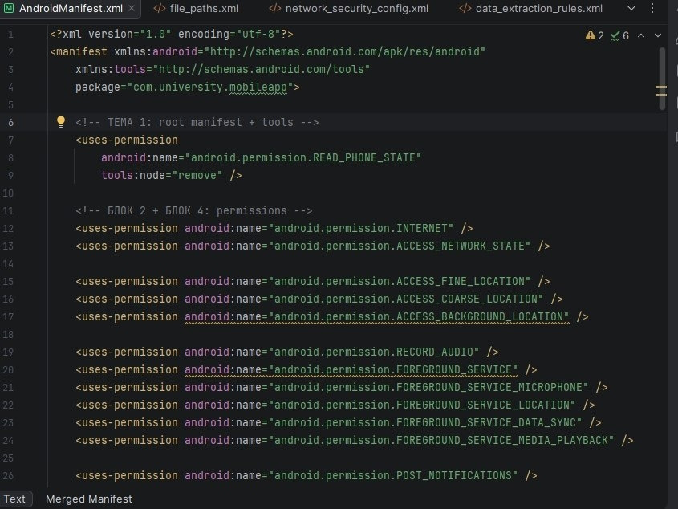
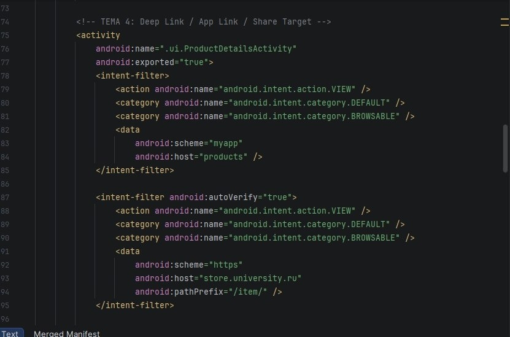

---

## Тема 2. Тег `<application>`: глобальные свойства приложения

Тег `<application>` задает мета-характеристики всего процесса: тему оформления, иконку, кастомный класс-наследник `Application`, правила резервного копирования и политику сетевой безопасности.

### Атрибуты безопасности и оформления

| Атрибут                         | Тип значения   | Назначение                                                      |
| :------------------------------ | :------------- | :-------------------------------------------------------------- |
| `android:name`                  | Класс (`.App`) | Кастомный подкласс `android.app.Application`                    |
| `android:icon` / `roundIcon`    | `@mipmap/*`    | Векторная или растровая адаптивная иконка                       |
| `android:theme`                 | `@style/*`     | Глобальная системная тема (Material 3)                          |
| `android:allowBackup`           | `boolean`      | Разрешение резервного копирования данных через ADB/Cloud        |
| `android:usesCleartextTraffic`  | `boolean`      | Разрешение незашифрованного HTTP-трафика (`false` по умолчанию) |
| `android:networkSecurityConfig` | `@xml/*`       | Ссылка на файл кастомных сертификатов и SSL-Pinning             |
| `android:supportsRtl`           | `boolean`      | Поддержка арабских и еврейских языков с письмом справа налево   |

### Пример кода

```xml
<application
    android:name=".AppController"
    android:allowBackup="false"
    android:icon="@mipmap/ic_launcher"
    android:roundIcon="@mipmap/ic_launcher_round"
    android:label="@string/app_name"
    android:supportsRtl="true"
    android:theme="@style/Theme.ModernApp"
    android:usesCleartextTraffic="false"
    android:networkSecurityConfig="@xml/network_security_config">

    <!-- Компоненты приложения -->
</application>
```

### Задания для закрепления

1. **Защита от утечки данных через бэкап:** Сконфигурируйте тег `<application>` для финансового приложения, полностью запретив бэкап и извлечение данных через утилиту ADB.
2. **Подключение SSL-Pinning конфига:** Добавьте атрибут `android:networkSecurityConfig` со ссылкой на XML-ресурс и составьте шаблон самого файла конфигурации безопасности.
3. **Регистрация кастомного Application:** Зарегистрируйте класс `.MainApplication`, в котором будет происходить инициализация DI-контейнера и аналитики.
4. **Локализация названия приложения:** Настройте атрибут `android:label` так, чтобы название бралось из строковых ресурсов с поддержкой динамической смены языка.
5. **Поддержка больших куч памяти (Large Heap):** Добавьте атрибут `android:largeHeap="true"` для графического редактора и обоснуйте риски его бездумного использования.

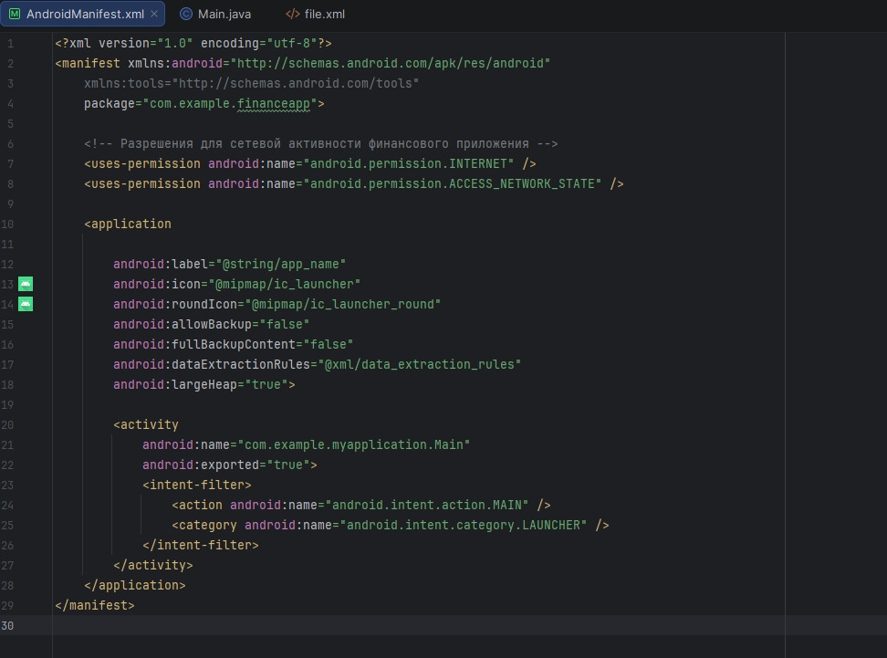

---

## Тема 3. Регистрация четырех фундаментальных компонентов

В Android любой компонент, способный выступать независимой точкой входа в приложение, обязан быть явно объявлен в манифесте.

### Архитектурные требования Android 12+ (API 31+)

Если компонент содержит `<intent-filter>`, атрибут `android:exported` **обязан** быть явно выставлен в `true` или `false`. Несоблюдение приводит к ошибке установки `INSTALL_FAILED_VERIFICATION_FAILURE`.

### Пример кода

```xml
<application ...>

    <!-- 1. Экран авторизации (Точка входа) -->
    <activity
        android:name=".ui.AuthActivity"
        android:exported="true">
        <intent-filter>
            <action android:name="android.intent.action.MAIN" />
            <category android:name="android.intent.category.LAUNCHER" />
        </intent-filter>
    </activity>

    <!-- 2. Внутренний экран профиля -->
    <activity
        android:name=".ui.ProfileActivity"
        android:exported="false"
        android:screenOrientation="portrait"
        android:launchMode="singleTop" />

    <!-- 3. Фоновая служба воспроизведения медиа (Android 14+) -->
    <service
        android:name=".playback.MediaService"
        android:exported="false"
        android:foregroundServiceType="mediaPlayback" />

    <!-- 4. Широковещательный приемник перезагрузки устройства -->
    <receiver
        android:name=".receivers.BootReceiver"
        android:exported="false">
        <intent-filter>
            <action android:name="android.intent.action.BOOT_COMPLETED" />
        </intent-filter>
    </receiver>

    <!-- 5. Провайдер безопасного обмена файлами -->
    <provider
        android:name="androidx.core.content.FileProvider"
        android:authorities="${applicationId}.fileprovider"
        android:exported="false"
        android:grantUriPermissions="true">
        <meta-data
            android:name="android.support.FILE_PROVIDER_PATHS"
            android:resource="@xml/file_paths" />
    </provider>

</application>
```

### Задания для закрепления

1. **Регистрация стартовой Activity:** Объявите экран `SplashScreenActivity` в качестве единственной стартовой точки запуска с главного экрана смартфона.
2. **Изоляция служебного сервиса:** Опишите фоновый сервис синхронизации локальной базы данных, гарантировав невозможность его вызова из внешних приложений.
3. **Блокировка пересоздания при повороте:** Сконфигурируйте для игровой Activity атрибут `android:configChanges="orientation|screenSize|keyboardHidden"`.
4. **Выбор режима запуска (launchMode):** Зарегистрируйте экран звонка `IncomingCallActivity` с режимом запуска `singleInstance`.
5. **Безопасная настройка FileProvider:** Напишите полную декларацию `FileProvider` для выдачи временного доступа камере к сохранению сделанного снимка.

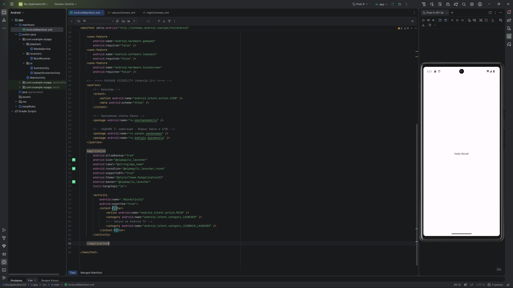

---

## Тема 4. Механизм `<intent-filter>` и Deep Links (App Links)

Интент-фильтры сообщают системе, какие неявные намерения (Implicit Intents) готов обработать компонент: открытие ссылки, отправка текста (`ACTION_SEND`), просмотр геоточки или веб-адреса.

### Структура Intent-фильтра

| Элемент      | Назначение                               | Типичные значения                                        |
| :----------- | :--------------------------------------- | :------------------------------------------------------- |
| `<action>`   | Действие, на которое реагирует компонент | `ACTION_VIEW`, `ACTION_SEND`, `ACTION_DIAL`              |
| `<category>` | Контекст использования                   | `DEFAULT`, `BROWSABLE`, `LAUNCHER`                       |
| `<data>`     | Схема, хост, путь и MIME-тип данных      | `scheme="https"`, `host="shop.ru"`, `mimeType="image/*"` |

### Пример кода (Android App Links с авто-верификацией)

```xml
<activity
    android:name=".ui.ProductDetailsActivity"
    android:exported="true">

    <!-- Кастомная схема: myapp://products/view?id=123 -->
    <intent-filter>
        <action android:name="android.intent.action.VIEW" />
        <category android:name="android.intent.category.DEFAULT" />
        <category android:name="android.intent.category.BROWSABLE" />
        <data android:scheme="myapp" android:host="products" />
    </intent-filter>

    <!-- Официальный App Link (проверяется через assetlinks.json на домене) -->
    <intent-filter android:autoVerify="true">
        <action android:name="android.intent.action.VIEW" />
        <category android:name="android.intent.category.DEFAULT" />
        <category android:name="android.intent.category.BROWSABLE" />
        <data
            android:scheme="https"
            android:host="store.university.ru"
            android:pathPrefix="/item/" />
    </intent-filter>

</activity>
```

### Задания для закрепления

1. **Перехват функции "Поделиться" (Share Target):** Зарегистрируйте Activity, способную принимать изображения любого формата через системный диалог `ACTION_SEND`.
2. **Обработка звонковых ссылок:** Настройте фильтр для перехвата номеров телефонов со схемой `tel:`.
3. **Диплинк с маской пути:** Напишите тег `<data>` с атрибутом `android:pathPattern`, фильтрующий только PDF-документы: `.*\\.pdf`.
4. **Фильтрация по нескольким MIME-типам:** Сконфигурируйте интент-фильтр, принимающий текстовые файлы (`text/plain`) и веб-страницы (`text/html`).
5. **Настройка авто-верификации (App Link):** Добавьте директиву `android:autoVerify="true"` и опишите назначение связи с файлом `/.well-known/assetlinks.json`.


---

## Тема 5. Разрешения: `<uses-permission>` и модель безопасности

Разрешения делятся на нормальные (Normal, выдаются при установке) и опасные (Dangerous, требуют runtime-запроса у пользователя).

### Современные требования Android 13–15+

- Доступ к уведомлениям требует отдельного разрешения `POST_NOTIFICATIONS`.
- Доступ к медиа разделен: `READ_MEDIA_IMAGES`, `READ_MEDIA_VIDEO`, `READ_MEDIA_AUDIO`.
- Сервисы переднего плана требуют явного указания типа разрешения: `FOREGROUND_SERVICE_LOCATION`, `FOREGROUND_SERVICE_CAMERA` и т.д.

### Пример кода

```xml
<manifest ...>

    <!-- 1. Нормальное разрешение (доступ в сеть) -->
    <uses-permission android:name="android.permission.INTERNET" />
    <uses-permission android:name="android.permission.ACCESS_NETWORK_STATE" />

    <!-- 2. Опасное разрешение (геолокация) -->
    <uses-permission android:name="android.permission.ACCESS_FINE_LOCATION" />
    <uses-permission android:name="android.permission.ACCESS_COARSE_LOCATION" />

    <!-- 3. Медиафайлы (Android 13+) -->
    <uses-permission android:name="android.permission.READ_MEDIA_IMAGES" />

    <!-- 4. Ограничение по версии SDK (вибрация только до Android 12) -->
    <uses-permission
        android:name="android.permission.VIBRATE"
        android:maxSdkVersion="31" />

    <!-- 5. Декларация собственного разрешения для защиты провайдера -->
    <permission
        android:name="com.university.permission.READ_INTERNAL_LOGS"
        android:protectionLevel="signature" />

</manifest>
```

### Задания для закрепления

1. **Разрешения для геолокационного трекера:** Объявите набор разрешений для непрерывного фонового трекинга: приблизительная геопозиция, точная геопозиция и фоновая геопозиция (`ACCESS_BACKGROUND_LOCATION`).
2. **Разрешение уведомлений:** Добавьте разрешение `POST_NOTIFICATIONS` с директивой поддержки обратной совместимости для старых версий ОС.
3. **Защита собственного компонента:** Создайте кастомное разрешение с уровнем защиты `signature`, чтобы только приложения с тем же ключом подписи могли обращаться к сервису.
4. **Ограничение максимальной версии SDK:** Используя атрибут `android:maxSdkVersion`, ограничьте действие разрешения записи во внешнюю память (`WRITE_EXTERNAL_STORAGE`) версией Android 9 (API 28).
5. **Точные будильники (Exact Alarms):** Зарегистрируйте разрешение `SCHEDULE_EXACT_ALARM` и объясните строгие правила модерации Google Play для этого типа разрешений.

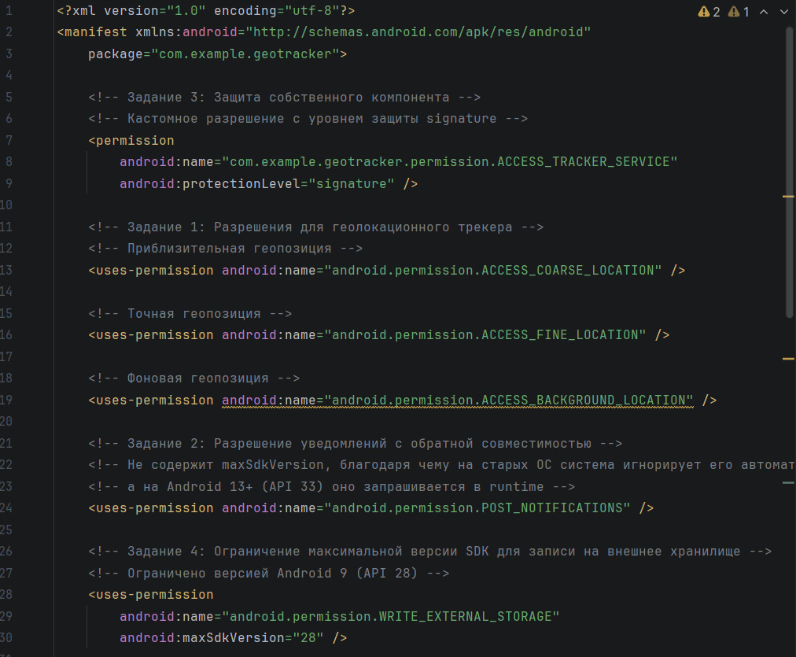
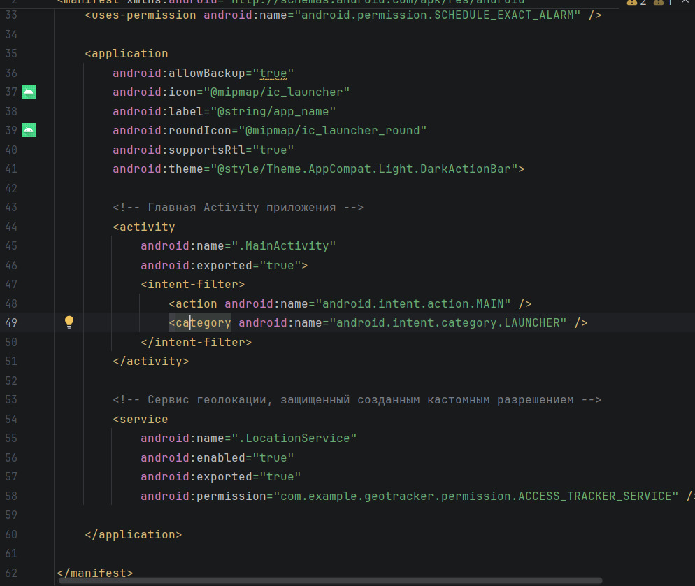

---

## Тема 6. Аппаратные фильтры `<uses-feature>` и видимость пакетов `<queries>`

Тег `<uses-feature>` фильтрует отображение приложения в Google Play в зависимости от наличия физических чипов и датчиков на устройстве. Тег `<queries>` (Android 11+) открывает видимость других установленных приложений (Package Visibility).

### Пример кода

```xml
<manifest ...>

    <!-- Требуется камера с автофокусом обязательно -->
    <uses-feature
        android:name="android.hardware.camera"
        android:required="true" />
    <uses-feature
        android:name="android.hardware.camera.autofocus"
        android:required="false" />

    <!-- Требуется модуль BLE (Bluetooth Low Energy) -->
    <uses-feature
        android:name="android.hardware.bluetooth_le"
        android:required="true" />

    <!-- Доступ к внешним пакетам (Package Visibility) -->
    <queries>
        <!-- Разрешить взаимодействие с браузерами -->
        <intent>
            <action android:name="android.intent.action.VIEW" />
            <data android:scheme="https" />
        </intent>
        <!-- Разрешить обращение к приложению оплаты конкретного банка -->
        <package android:name="ru.sberbankmobile" />
    </queries>

</manifest>
```

### Задания для закрепления

1. **Необязательный датчик отпечатка пальца:** Опишите фичу сканера отпечатков пальцев так, чтобы приложение могло устанавливаться на устройства без биометрии.
2. **Фильтрация устройств с NFC:** Напишите манифест-декларацию для платежного стикера или терминала, требующую физического наличия чипа NFC.
3. **Декларация вызова сторонней навигации:** С помощью блока `<queries>` опишите возможность проверки наличия установленного приложения Яндекс Карты или 2ГИС.
4. **Телефония и отправка SMS:** Задекларируйте признак `android.hardware.telephony` со значением `required="false"` для обеспечения совместимости приложения с планшетами без SIM-карт.
5. **Поддержка контроллеров:** Настройте фичу поддержки геймпадов для Android TV версии вашего приложения.

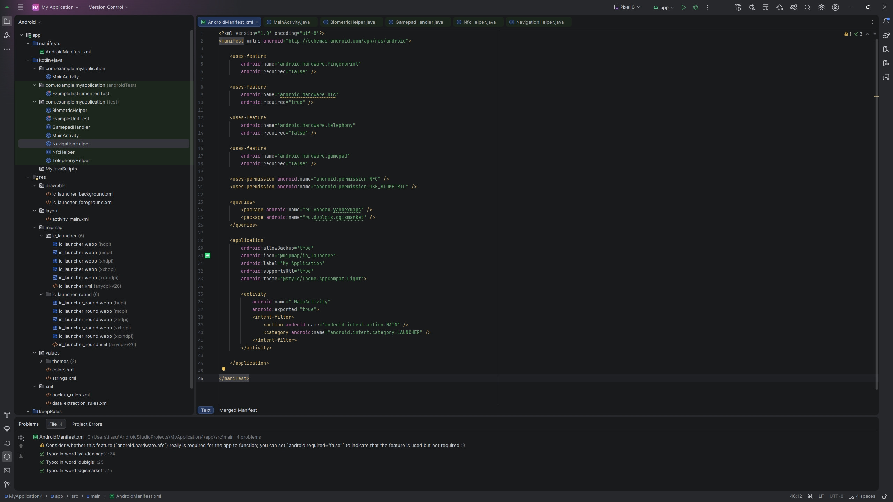

---

## Тема 7. Метаданные `<meta-data>` и тонкая конфигурация окружения

Тег `<meta-data>` передает произвольные пары «ключ-значение» системным компонентам и внешним SDK (Google Maps, аналитика, архитектурные провайдеры).

### Пример кода

```xml
<application ...>

    <!-- API ключ картографического сервиса -->
    <meta-data
        android:name="com.google.android.geo.API_KEY"
        android:value="@string/google_maps_key" />

    <!-- Отключение автоматической инициализации Firebase Analytics -->
    <meta-data
        android:name="firebase_analytics_collection_deactivated"
        android:value="true" />

    <!-- Файл конфигурации мультиязычности (Per-App Language) -->
    <meta-data
        android:name="android.content.res.LocaleConfig"
        android:resource="@xml/locales_config" />

</application>
```

### Задания для закрепления

1. **Интеграция карт:** Добавьте тег метаданных для внедрения ключа Яндекс MapKit внутри элемента `<application>`.
2. **Конфигуратор смены языка внутри приложения:** Зарегистрируйте ресурс `LocaleConfig` для встроенного селектора языков в Android 13+.
3. **Метаданные внутри конкретной Activity:** Привяжите системный поисковый конфигуратор (`android.app.searchable`) к конкретному экрану `SearchActivity`.
4. **Отключение Startup-библиотеки:** Настройте метаданные для ручной инициализации библиотеки `androidx.startup`.
5. **Масштабирование экранов (High Refresh Rate):** Добавьте мета-параметры для активации поддержки частоты развертки дисплея 120 Гц.

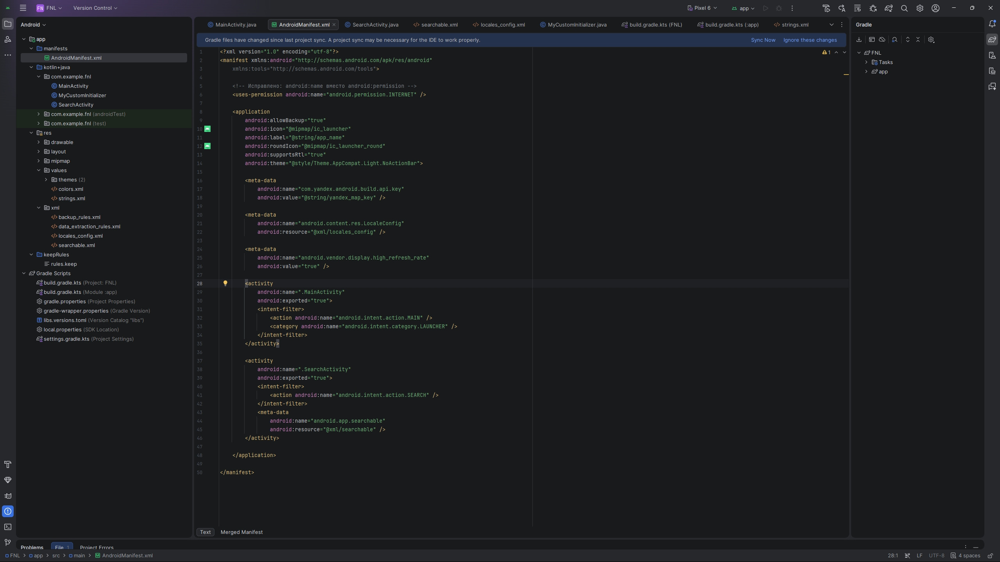

---

## Практические задания:

Задания разделены по реальным сценариям разработки коммерческих приложений (FinTech, IoT, Media, Social, Delivery, Enterprise).

### Блок 1: Архитектура, слияние манифестов и запуск 

1. **Диагностика конфликта библиотек:** Внешняя библиотека объявляет `minSdkVersion="24"`, а ваш проект `minSdkVersion="21"`. Напишите директиву `tools:overrideLibrary`, разрешающую конфликт.
2. **Скрытие иконки приложения из лаунчера:** Сконфигурируйте Activity так, чтобы она была доступна только по вызову из другого приложения, но не отображалась в списке приложений смартфона.
3. **Splash Screen в Android 12+:** Настройте метаданные и тему стартового экрана `Theme.SplashScreen` в блоке Activity в соответствии со стандартами Android Core Splashscreen.
4. **Алиас Activity (activity-alias):** Создайте псевдоним `<activity-alias>` для динамической смены новогодней иконки приложения через `PackageManager`.
5. **Режим отображения "Картинка в картинке" (PiP):** Включите поддержку Picture-in-Picture (`android:supportsPictureInPicture="true"`) и настройте корректные флаги смены конфигураций экрана.
6. **Многооконный режим (Multi-Window):** Ограничьте минимальные размеры плавающего окна приложения атрибутом `<layout android:minWidth="300dp" android:minHeight="450dp" />`.
7. **Изоляция в отдельном процессе:** Настройте запуск фонового аудиосервиса в независимом системном процессе операционной системы с помощью атрибута `android:process=":playback_process"`.
8. **Исключение из меню недавних приложений (Recents):** Настройте атрибут `android:excludeFromRecents="true"` для экрана ввода мастер-пароля.
9. **Защита от скриншотов и превью:** Объясните, какие настройки манифеста влияют на превью экрана в списке задач и как они соотносятся с программным флагом `FLAG_SECURE`.
10. **Кастомный класс TestInstrumentationRunner:** Задекларируйте тег `<instrumentation>` для запуска кастомного раннера UI-тестов.

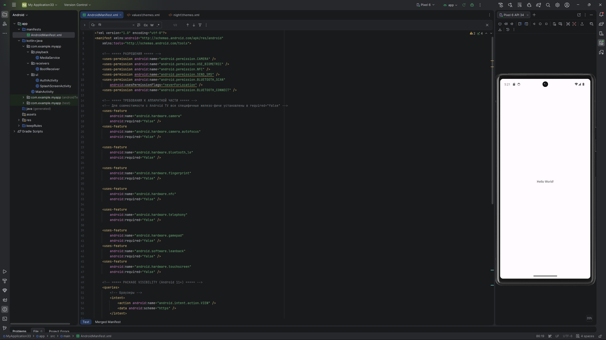

### Блок 2: Безопасность, шифрование и сетевой контур

11. **Блокировка инъекции динамического кода:** Сконфигурируйте тег манифеста для защиты от динамической загрузки вредоносного байт-кода (`android:isolatedProcess="true"` для сервиса).
12. **Разрешение локального HTTP для разработки:** Напишите XML-конфиг сетевой безопасности, разрешающий незашифрованный трафик исключительно для IP-адреса локального сервера `192.168.1.50` и блокирующий его для внешнего интернета.
13. **Защита Content Provider от атак внедрения:** Спроектируйте объявление провайдера с раздельными правами на чтение и запись (`android:readPermission` и `android:writePermission`).
14. **Декларация временных разрешений на URI:** Настройте тег `<grant-uri-permission android:pathPrefix="/shared_docs/" />` внутри безопасного провайдера данных.
15. **Запрет отладки приложения в продакшене:** Убедитесь в отсутствии уязвимости с помощью директивы `android:debuggable="false"` с механизмом принудительной замены сборщиком.
16. **Защита BroadcastReceiver от поддельных широковещательных сообщений:** Закройте неэкспортированный ресивер системным разрешением уровня `signature`.
17. **Разграничение доступа через системные роли:** Ограничьте вызов Activity разрешением `android.permission.BIND_ACCESSIBILITY_SERVICE`.
18. **Политика обработки резервных копий (Backup Rules):** Создайте файл `@xml/backup_rules` и привяжите его в манифесте через `android:fullBackupContent` и `android:dataExtractionRules`.
19. **Защита от Overlay-атак (Tapjacking):** Сконфигурируйте фильтрацию входящих касаний для экрана подтверждения банковской транзакции.
20. **Аудит манифеста утилитой Androbugs:** Выявите 3 критические уязвимости в представленном фрагменте манифеста с открытым `exported="true"` без разрешений.

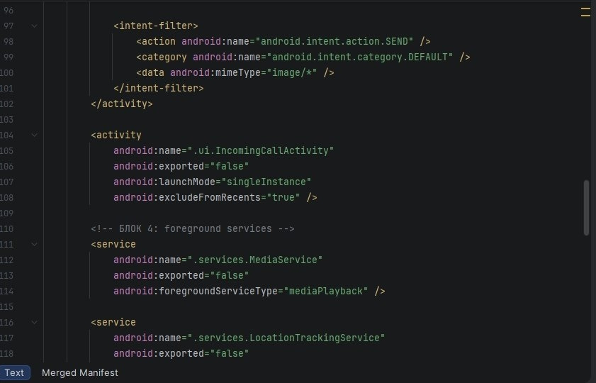
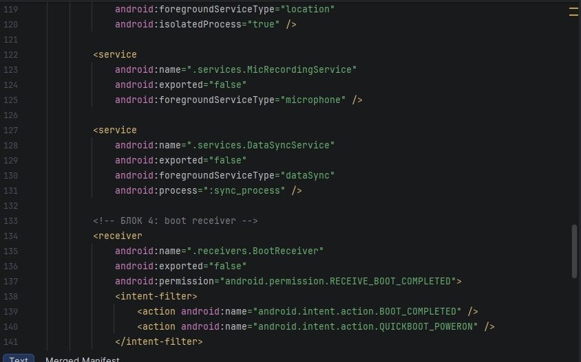
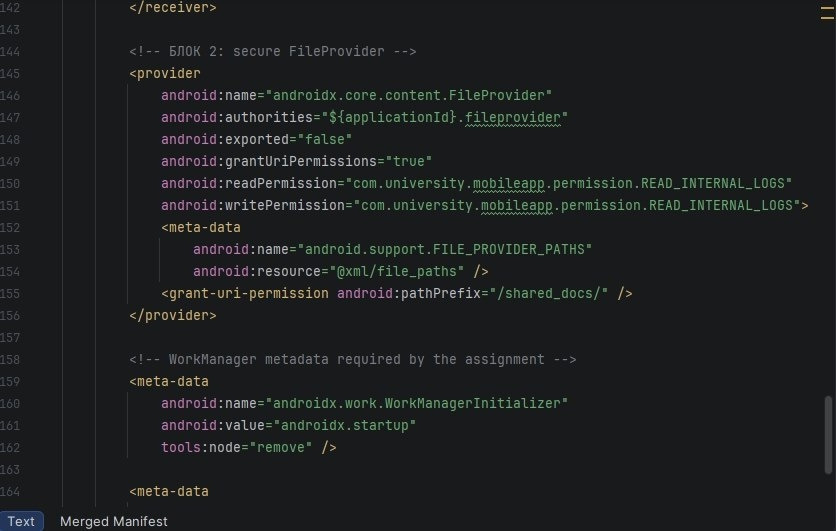
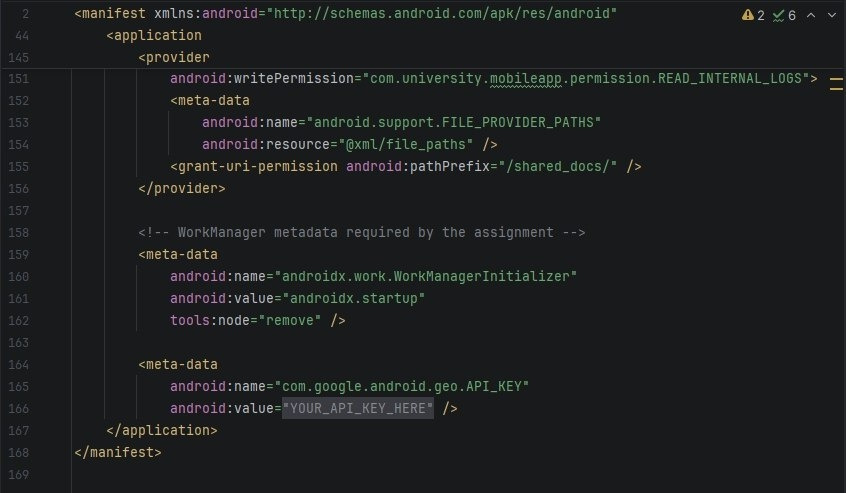

### Блок 3: Интент-фильтры, интеграция и Deep Links 

21. **Интеграция с NFC-ридером (NFC Tag Dispatch):** Напишите интент-фильтр для перехвата смарт-карты стандарта Mifare: `android.nfc.action.TECH_DISCOVERED`.
22. **Открытие геопозиции на внешней карте:** Сконфигурируйте Activity, перехватывающую запросы по схеме `geo:0,0?q=`.
23. **Обработка вложений электронной почты:** Настройте фильтр для открытия файлов расширения `.docx` и `.xlsx` с MIME-типом `application/*`.
24. **Интеграция с Google Assistant / App Actions:** Задекларируйте файл шорткатов `<meta-data android:name="android.app.shortcuts" android:resource="@xml/shortcuts" />`.
25. **Глубокая ссылка интернет-магазина (Deep Link):** Задекларируйте фильтр, принимающий ссылку вида `https://marketplace.com/catalog/shoes?brand=nike` с верификацией домена.
26. **Перехват нажатия аппаратной кнопки гарнитуры:** Настройте BroadcastReceiver для приема события `android.intent.action.MEDIA_BUTTON`.
27. **Обработка системного поиска:** Зарегистрируйте компонент со специальным действием `android.intent.action.SEARCH`.
28. **Открытие экрана создания SMS:** Напишите интент-фильтр со схемой `smsto:` для отправки сообщений.
29. **Авторизация через OAuth (Custom Tab Callback):** Сконфигурируйте Activity для перехвата редиректа вида `org.example.app://oauth-callback`.
30. **Открытие файла конфигурации по кастомному расширению:** Сделайте так, чтобы файлы `.mycfg` открывались в вашей программе по умолчанию.

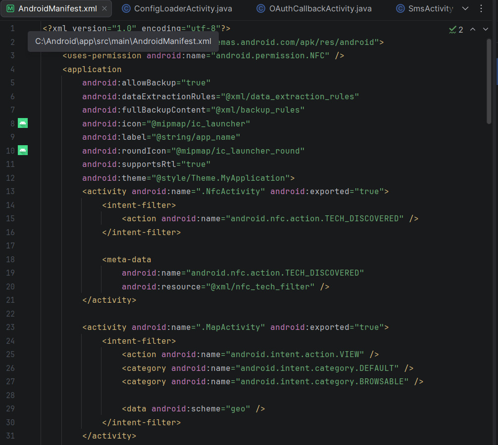
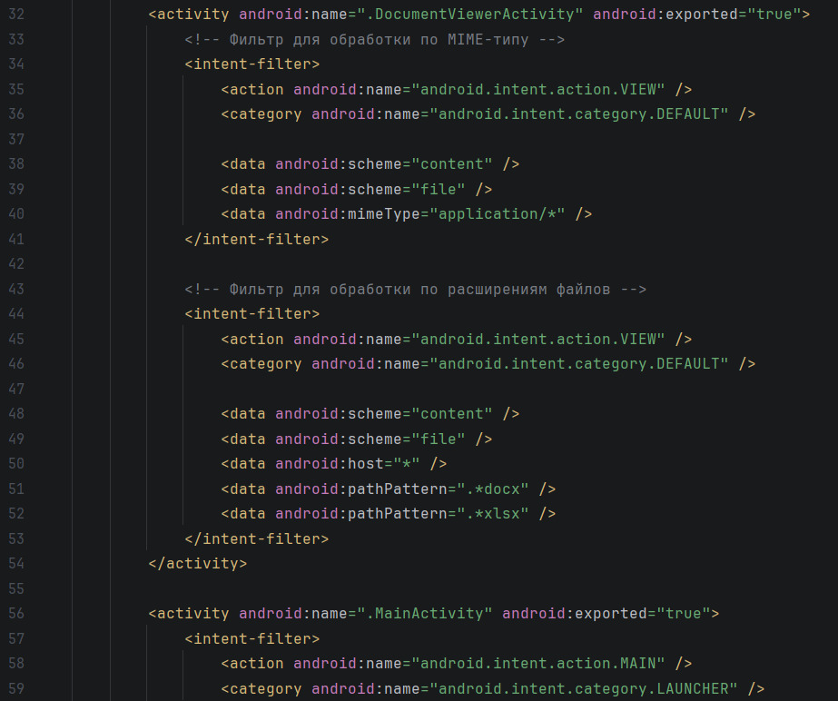
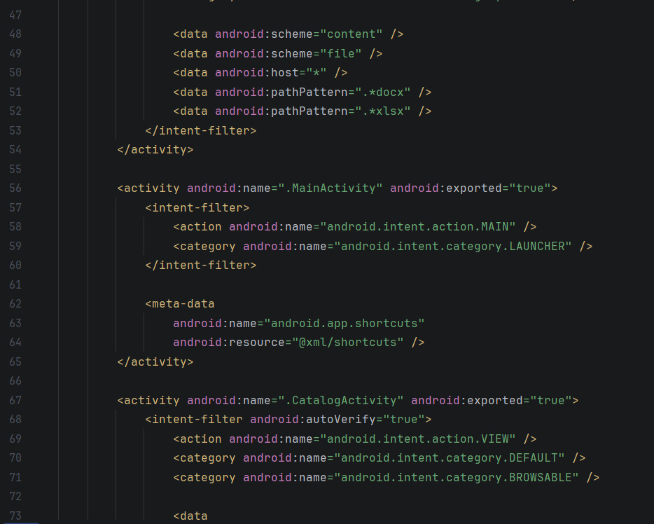
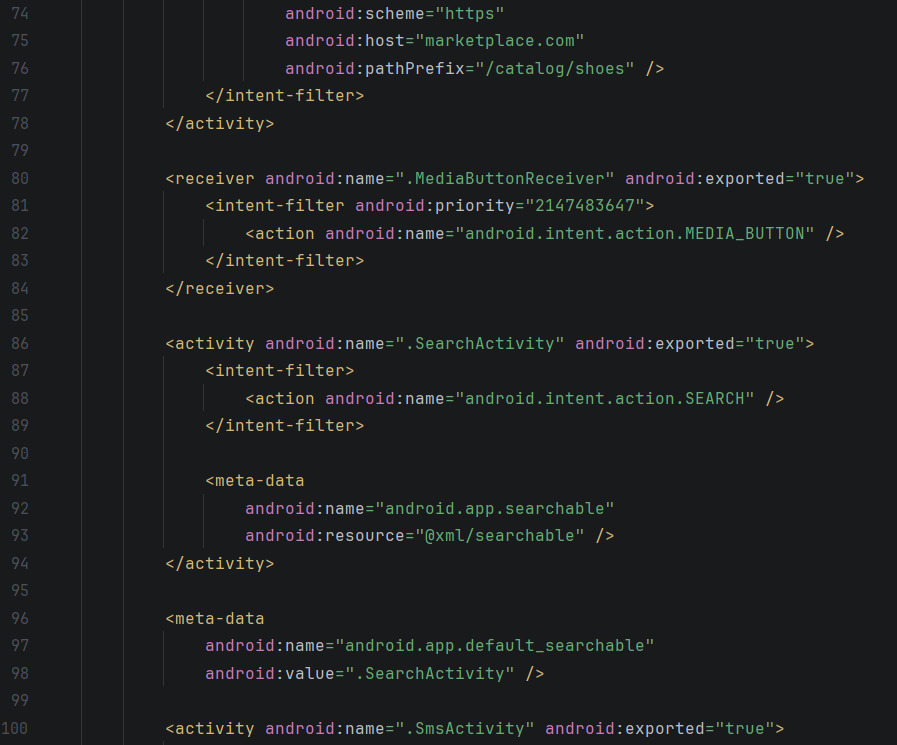
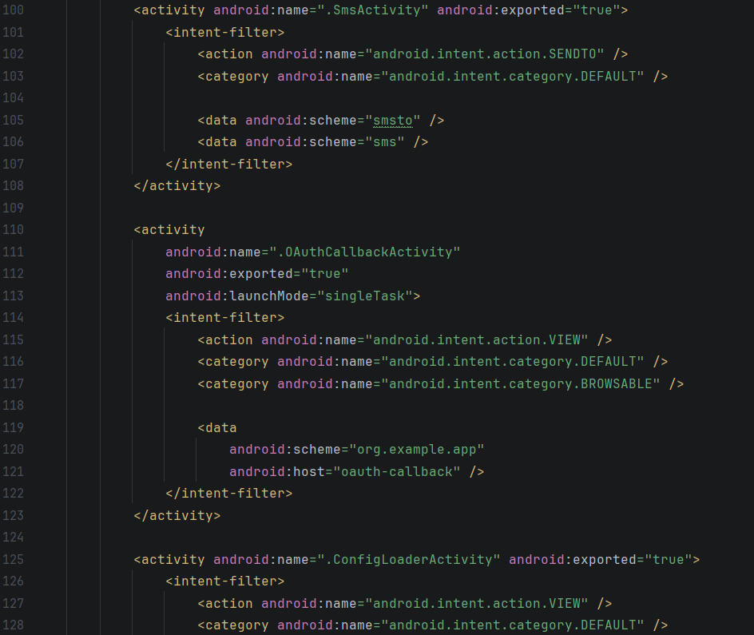

### Блок 4: Сервисы, фоновые задачи и Android 14+ требования 

31. **Foreground Service типа "Микрофон":** Объявите сервис записи голосовых заметок с обязательным указанием `android:foregroundServiceType="microphone"` и соответствующим разрешением.
32. **Foreground Service типа "Геолокация":** Настройте сервис пешего курьера с типом `location` и правами фоновой геолокации.
33. **Сервис загрузки тяжелых файлов:** Задекларируйте Foreground Service типа `dataSync` с указанием таймаута выполнения.
34. **Сервис стриминга видео на ТВ:** Сконфигурируйте сервис с типом `mediaProjection`.
35. **Планировщик WorkManager:** Настройте системные компоненты библиотеки WorkManager через метаданные для отключения дефолтной авто-инициализации.
36. **Автозапуск сервиса после перезагрузки:** Соберите правильную комбинацию: разрешение `RECEIVE_BOOT_COMPLETED`, регистрация ресивера и вызов фоновой службы.
37. **Контроль энергосбережения (Doze Mode):** Задекларируйте разрешение `REQUEST_IGNORE_BATTERY_OPTIMIZATIONS` и укажите в комментариях риски блокировки в Google Play.
38. **Служба специальных возможностей (Accessibility Service):** Напишите блок объявления службы спец. возможностей с файлом метаданных `accessibility_service_config`.
39. **Служба синхронизации аккаунтов (SyncAdapter):** Опишите компонент службы синхронизации с метаданными `@xml/syncadapter`.
40. **Служба обоев (Live Wallpaper):** Зарегистрируйте `WallpaperService` с необходимым системным разрешением `android.permission.BIND_WALLPAPER`.


### Блок 5: Аппаратные модули, экраны и адаптивность

41. **Поддержка складных смартфонов (Foldables):** Объявите поддержку динамического изменения геометрии экрана и соотношений сторон через `android:maxAspectRatio` и `android:minAspectRatio`.
42. **Приложение для умных часов (Wear OS):** Настройте манифест с тегом `<uses-feature android:name="android.hardware.type.watch" />`.
43. **Приложение для автомобильных медиасистем (Android Auto):** Добавьте дескриптор метаданных `com.google.android.gms.car.application` с конфигурацией автомобильного интерфейса.
44. **Приложение для умного ТВ (Android TV):** Настройте категорию `LEANBACK_LAUNCHER` и флаг отсутствия обязательного тачскрина (`android.hardware.touchscreen = false`).
45. **Поддержка стилуса и планшетного ввода:** Опишите требования к расширенному сенсорному экрану.
46. **Режим высокой плотности пикселей (Density Independence):** Сконфигурируйте узел `<supports-screens>` для запрета работы приложения на устаревших экранах низкой плотности.
47. **Высокая частота опроса сенсоров:** Задекларируйте разрешение `HIGH_SAMPLING_RATE_SENSORS` для точного гироскопа в гоночной игре.
48. **Интеграция с фонариком устройства:** Опишите признак вспышки камеры `android.hardware.camera.flash` как опциональный.
49. **Доступ к USB-аксессуарам (OTG):** Настройте интент-фильтр и метаданные для автоматического запуска приложения при подключении внешнего USB-устройства (`android.hardware.usb.action.USB_DEVICE_ATTACHED`).
50. **Комплексный production-манифест:** Соберите итоговый манифест защищенного финтех-приложения со стартовым экраном, FileProvider, тремя опасными разрешениями, App Link и строгой политикой сетевой безопасности.

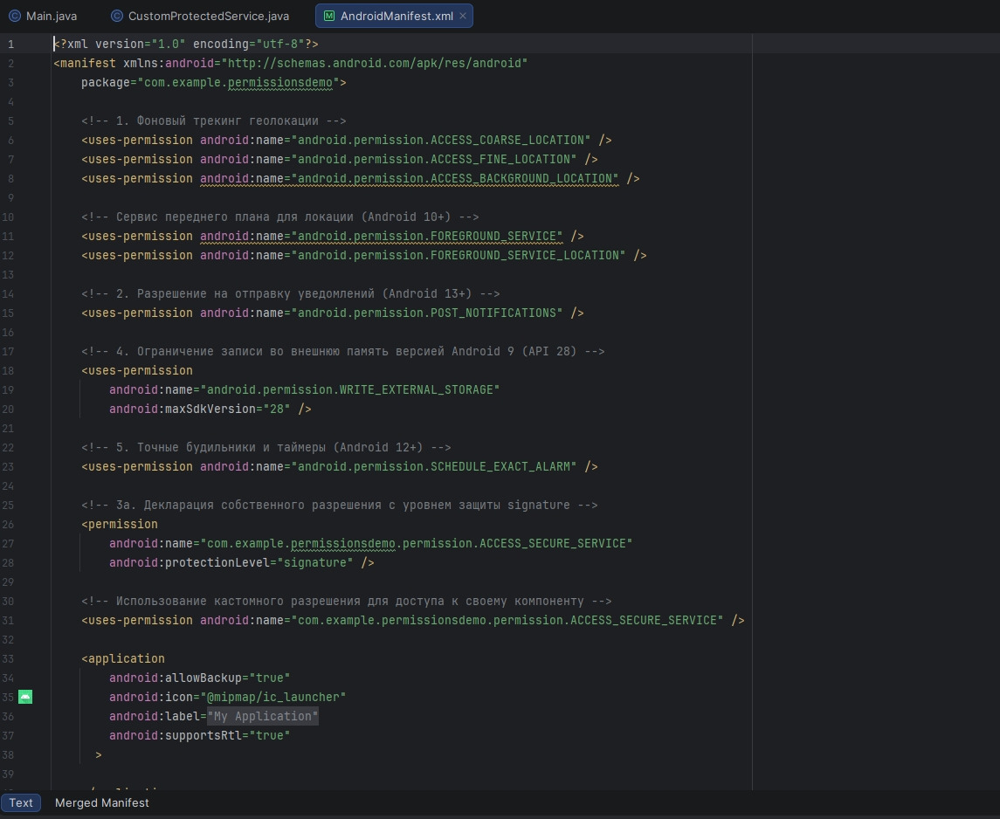

---
